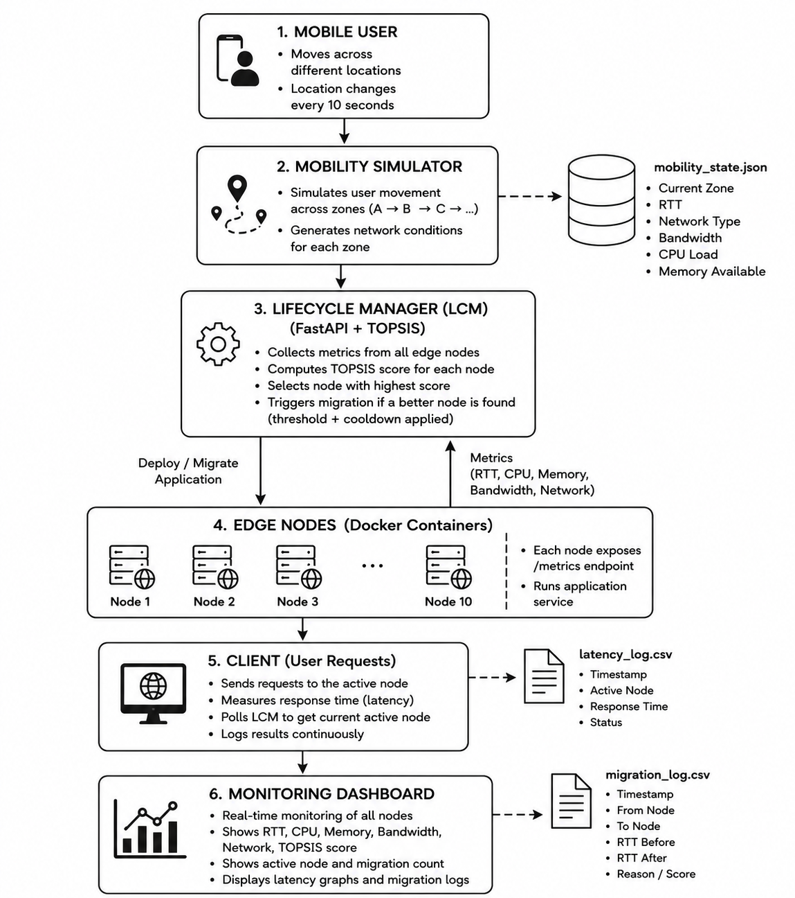

# 🧬 MEC-LifeGuard

[](https://www.python.org/)
[](https://fastapi.tiangolo.com/)
[](https://flask.palletsprojects.com/)
[](https://www.docker.com/)
[](https://opensource.org/licenses/MIT)

**MEC-LifeGuard** is an ETSI MEC-inspired Application Lifecycle Management (LCM) and simulation platform. It showcases dynamic workload migrations (handovers) across a network of dockerized edge nodes. Using a **TOPSIS** (Technique for Order of Preference by Similarity to Ideal Solution) decision-making engine, the LCM automatically migrates active application sessions based on physical user mobility, server CPU/memory load, channel bandwidth, and network conditions.

---

## 🗺️ System Architecture

MEC-LifeGuard is composed of five main components interacting in real time:

1. **Edge Node Grid**: 10 identical Flask applications running in Docker containers (`edge-node-1` to `edge-node-10`). They simulate edge servers processing user workloads and reading physical channel/node characteristics.
2. **Lifecycle Manager (LCM)**: A FastAPI controller acting as the central orchestrator. It polls node health, computes TOPSIS rankings, and executes atomic 5-step application migrations.
3. **Mobility Simulator**: A background generator that models user movement across 10 physical zones, continuously updating network metrics (latency, bandwidth, network type) and simulating server loads/failures.
4. **Simulated Client**: An active user sending continuous requests (`POST /process`) to whichever edge node the LCM designates as active, recording actual end-to-end RTT and server metrics.
5. **Live Rich Dashboard & Plotter**: A terminal-based HUD displaying node rankings and migration history, accompanied by a Matplotlib results visualizer.



---

## ✨ Key Features

- **🌐 10-Node Docker Orchestration**: Spin up a complete multi-server edge grid mapping host ports `5001-5010` using `docker-compose`.
- **📈 Real-Time Mobility Simulation**: Models transitions between Cellular network generations (4G, 5G, 6G) and Bluetooth, injecting distance-based latency and bandwidth variance.
- **🧠 TOPSIS Decision Engine**: Multi-criteria ranking analyzing **6 distinct criteria** with custom weights:
  - *RTT* (Latency, weight = `0.30`) — Lower is better.
  - *CPU Usage* (weight = `0.20`) — Lower is better.
  - *Bandwidth* (weight = `0.20`) — Higher is better.
  - *Network Score* (6G/5G/4G/Bluetooth weight = `0.15`) — Higher is better.
  - *Memory Usage* (weight = `0.10`) — Lower is better.
  - *Migration Cost* (Memory footprint / Bandwidth, weight = `0.05`) — Lower is better.
- **⚡ Bluetooth Forced Handover**: Instantly detects low-quality connections (e.g., Bluetooth) and triggers an immediate failover, bypassing the normal migration cooldown period to restore high-quality service.
- **🛡️ 5-Step Atomic Migration**: Prevents traffic loss using a strict lifecycle sequence:
  1. **Deploy** target application -> 2. **Poll /health** until ready -> 3. **Atomically switch pointer** -> 4. **Terminate** source application -> 5. **Log** event.
- **📊 Interactive Rich HUD**: Beautiful terminal dashboard displaying realtime CPU, memory, latency, TOPSIS score, and active connection status.

---

## 📂 Project Structure

```text
├── client/
│   ├── client.py              # Simulates client workload requests
│   └── latency_log.csv        # Log of client-measured RTT (Git ignored)
├── dashboard/
│   ├── plot_results.py        # Generates publication-quality charts
│   └── rich_dashboard.py      # Rich terminal dashboard
├── edge_node/
│   ├── app.py                 # Flask app for edge nodes
│   ├── Dockerfile             # Container blueprint
│   └── requirements.txt       # Flask and psutil dependencies
├── lcm/
│   ├── decision.py            # LCM Migration policy & failover triggers
│   ├── main.py                # FastAPI lifecycle orchestrator
│   ├── migration_log.py       # Thread-safe migration logger
│   ├── topsis.py              # TOPSIS scoring mathematics
│   └── requirements.txt       # FastAPI, uvicorn, and pydantic dependencies
├── mobility_simulator/
│   ├── simulator.py           # Simulates user movement and node loads
│   └── mobility_state.json    # Shared state exchange file (Git ignored)
├── results/                   # Analytics output directory
│   ├── migration_log.csv      # Persistent migration log (Git ignored)
│   ├── latency_timeseries.png # Plot output (Git ignored)
│   └── node_scores.png        # Plot output (Git ignored)
├── docker-compose.yml         # Defines edge-node services
└── venv/                      # Python virtual environment (Git ignored)
```

---

## 🛠️ Installation & Setup

### 1. Prerequisites
- **Python 3.9+** installed locally.
- **Docker & Docker Compose** installed and running.

### 2. Configure Python Virtual Environment
Clone the repository, initialize a Python virtual environment, and install dependencies:

```powershell
# Create virtual environment
python -m venv venv

# Activate virtual environment
# On Windows (PowerShell):
.\venv\Scripts\Activate.ps1
# On Linux/macOS:
source venv/bin/activate

# Install dependencies for control components
pip install -r lcm/requirements.txt
pip install rich matplotlib pandas
```

---

## 🚀 How to Run the Simulation

To execute the full simulation, open **four terminal windows** (with your virtual environment activated):

### Step 1: Spin up the Edge Servers
Run the 10 dockerized edge nodes.
```bash
docker compose up --build
```

### Step 2: Start the Lifecycle Manager (LCM)
Runs the brain on port `8000`.
```bash
python -m uvicorn lcm.main:app --host 0.0.0.0 --port 8000
```

### Step 3: Run the Mobility Simulator
Starts physical user tracking and modifies node channel statistics every 5 seconds.
```bash
python mobility_simulator/simulator.py
```

### Step 4: Run the Client Application
Deploys the application on the best node initially and starts querying the active server every second.
```bash
python client/client.py
```

---

## 🖥️ Operations & Analytics

### 1. Launch the Live terminal HUD
Open a separate terminal window to view server metrics, live TOPSIS rankings, and active migration progress:
```bash
python dashboard/rich_dashboard.py
```

### 2. Plot Simulation Results
After letting the simulation run for a few minutes (e.g., through several zones), stop the client and simulator (`Ctrl+C`), then generate analytics plots:
```bash
python dashboard/plot_results.py
```
This produces two visualization files in the `results/` folder:
- `latency_timeseries.png`: Displays RTT measurements over time overlaid with vertical red indicators indicating exactly when and where migrations occurred.
- `node_scores.png`: Compares the average RTT experienced across each of the 10 edge servers.

---

## ⚙️ REST API Endpoints (LCM)

The Lifecycle Manager exposes REST API endpoints on port `8000` (Swagger UI is available at `http://localhost:8000/docs`):

| Method | Endpoint | Description |
| :--- | :--- | :--- |
| `POST` | `/app/deploy` | Auto-deploys application to the best node in the network |
| `GET` | `/app/status` | Queries the currently active serving node and current load |
| `POST` | `/app/migrate` | Manually triggers migration to a target node |
| `DELETE` | `/app/terminate` | Terminates application execution on the active node |
| `GET` | `/nodes` | Lists all 10 edge servers, current stats, and TOPSIS scores |
| `GET` | `/migrations` | Returns the history of migration events |
| `GET` | `/metrics` | Exposes Prometheus exposition format metrics |
